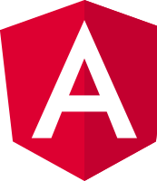
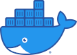

# Wheelsage.org / AutoWP.ru website sources

<https://wheelsage.org/>

<https://autowp.ru/>

======

## Requirements

## Credits

- [Dmitry P.](https://github.com/autowp)
- [Contributors](https://github.com/autowp/autowp/contributors)

## License

The MIT License (MIT). Please see [License File](https://github.com/autowp/autowp/blob/master/LICENSE) for more information.

